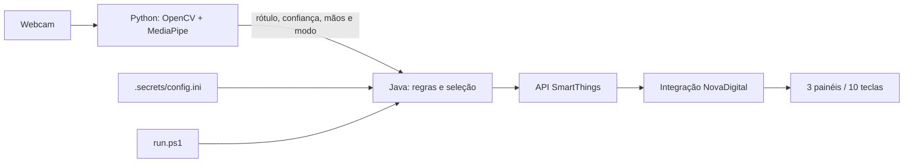

# Gesture Switch

Projeto independente para comandar a luz da sala com a webcam. O Java controla as regras de segurança e o envio dos comandos. Um processo Python usa OpenCV e o modelo oficial MediaPipe Gesture Recognizer para observar até duas mãos; envia somente rótulo, confiança e número de mãos para o Java. As imagens ficam no PC e não são salvas por este programa.

## Começar depois de baixar o projeto

No Windows, instale JDK 17 ou superior, Maven e Python 3.13. Abra o PowerShell na pasta do projeto e execute:

```powershell
.\setup.ps1
.\run.ps1
```

A primeira instalação usa **simulação**: a webcam funciona e os comandos aparecem no terminal, sem acionar dispositivos. `setup.ps1` cria `.secrets/config.ini` a partir de `config.example.ini`, baixa o modelo e instala as dependências. Uma configuração privada já existente é preservada. Para controlar aparelhos reais, preencha o arquivo privado e siga a seção de integração SmartThings. O repositório não inclui token, IP, MAC, ID de aparelho nem o pareamento da instalação original.

Para conferir compilação, testes e arquivos publicáveis, execute `.\verify.ps1`. Os testes usam simulação e não enviam comandos aos interruptores.

## Mapa do funcionamento



O **Python** captura os quadros, encontra os 21 pontos das mãos, reconhece palmas e punhos e conta os dedos das duas mãos. O **Java** recebe somente observações de texto, confirma a estabilidade, escolhe quais canais ligar ou apagar e chama a API SmartThings. `run.ps1` compila/inicia o Java, que inicia o processo Python. `.secrets/config.ini` guarda o token e os IDs dos canais, fora do Git.

**Estado atual:** integração SmartThings ativa no arquivo privado. A conta NovaDigital foi vinculada ao SmartThings, e o projeto identifica os três controles gerais (`_all`) dos painéis. Um teste manual de `on` e `off` pela API mudou os estados de todas as teclas dos três painéis. O modo Geral alterna oito grupos individuais e permite manter várias luzes acesas; dez dedos ligam tudo e um punho apaga tudo. O token fica em `.secrets/config.ini`, fora do Git, e precisa ser renovado após 24 horas. O controle local Tuya continua opcional e exige chaves locais não disponíveis no app.

## Identificar o interruptor sem alterar o pareamento

**Referência informada:** [anúncio de interruptor NovaDigital de quatro teclas Wi-Fi](https://www.mercadolivre.com.br/interruptor-inteligente-nova-digital-4-teclas-wifi/up/MLBU2187243059). O anúncio declara o código **WS-US LITE** e menciona Smart Life, mas o interruptor instalado pode ser uma variante. A [linha LITE no site da fabricante](https://www.novadigitalsmart.com.br/produtos/interruptor-inteligente-lite-lite-s-1-2-3-4) é Wi-Fi e pode ter de uma a quatro teclas. O anúncio serve para orientar a identificação, não para configurar comandos no aparelho real.

1. No app NovaDigital, abra **Sala > edição/ícone de lápis > Informações do dispositivo** (o nome do menu pode variar). Anote o **modelo exato**, número de teclas/canais, tipo **Wi-Fi ou Zigbee** e, se for Zigbee, o modelo do hub. Confira também a caixa ou o manual. Não abra a caixa elétrica energizada para procurar etiqueta.
2. Na Alexa, veja em **Dispositivos > luz da sala > configurações** por qual *skill* ou hub ela foi descoberta. Isso ajuda a identificar o caminho, mas não prova suporte a API local.
3. Envie foto da caixa/etiqueta ou captura das informações do app, ocultando número de série, MAC, QR code e dados de conta. Diga também se a luz já aparece na conta **Tuya Smart/Smart Life**, sem adicionar ou redefinir o interruptor.

Em cada interruptor com várias teclas, confirme **qual tecla/canal controla a luz da sala**. Antes de habilitar o backend real, teste no serviço de integração as três entidades corretas. Os comandos gerais enviam estados explícitos de ligar ou apagar; no modo Geral, a seleção individual consulta o estado atual e envia o estado oposto.

### Possibilidade de controle direto pela rede Wi-Fi

Alguns dispositivos compatíveis com Tuya expõem um protocolo local TCP, mas **IP e ID virtual não bastam para comandá-los**. A viabilidade depende da versão do protocolo, de uma chave local válida, do canal de cada tecla e de o firmware aceitar a conexão. A obtenção da chave local para uma conta vinculada apenas ao app NovaDigital ainda não foi confirmada. Não restaure nem emparelhe novamente o interruptor para procurá-la: a chave pode mudar com novo pareamento.

Com o IP local exibido no app, pode-se fazer uma checagem **sem comando ao interruptor** no PowerShell:

```powershell
Test-NetConnection -ComputerName IP_LOCAL_DO_DISPOSITIVO -Port 6668
```

Substitua pelo IP local do seu dispositivo. `TcpTestSucceeded: True` mostra apenas que a porta respondeu; **não** confirma autenticação ou compatibilidade. `False` também não prova que não exista nenhuma integração, pois a rede ou o firmware podem restringir conexões. Alguns dispositivos aceitam uma única conexão local por vez; por isso o funcionamento simultâneo com o app precisa ser testado no modelo real. O app e a Alexa podem continuar vinculados à nuvem, mas não há garantia de que duas conexões locais funcionem sem disputa.

Se houver vários aparelhos Tuya na mesma rede e os MACs não coincidirem com os mostrados no app, uma descoberta local **somente de leitura** pode associar o IP aos seis caracteres finais do ID virtual, sem imprimir o ID completo:

```powershell
.\.venv\Scripts\python.exe -m pip install -r requirements-diagnostics.txt
.\.venv\Scripts\python.exe diagnostics\scan_tuya.py
```

Compare localmente o final do ID no NovaDigital com a coluna do diagnóstico. A descoberta confirma IP e versão anunciada, mas **não fornece a chave local** necessária para enviar comandos.

A NovaDigital vende modelos Wi-Fi e Zigbee. O PC cabeado pode alcançar um serviço na rede ou na nuvem, mas isso não implica que o próprio interruptor aceite comandos IP. Para modelos Zigbee, o caminho passa por um hub. Se o dispositivo já estiver na conta Tuya Smart/Smart Life, a integração oficial Tuya do Home Assistant pode expô-lo. Ela exige dispositivos nessa conta; não há garantia de que a conta do app NovaDigital seja aceita. A documentação da plataforma Tuya descreve vínculo de **conta Smart Life** ou de **app OEM próprio** com um projeto; isso não autoriza presumir que uma conta NovaDigital de consumidor possa ser vinculada a um projeto de terceiros. Não remova, resete, migre ou emparelhe novamente o dispositivo só para testar.

## Instalar no Windows

Pré-requisitos: Java/JDK 17 ou superior, Maven, Python 3.13 (neste PC já existem Java 24, Maven e Python 3.13), webcam e internet na instalação inicial. No PowerShell, dentro desta pasta:

```powershell
.\setup.ps1
.\run.ps1
```

`setup.ps1` cria `.venv`, instala MediaPipe e suas dependências, baixa o modelo oficial em `models/`, cria `.secrets/config.ini` se ainda não existir e compila o Java. `run.ps1` compila o Java e inicia a janela da webcam no novo modo **Geral**. Os **21 pontos detectados e suas conexões** aparecem sobre a mão: verde para gesto de ligar/selecionar, laranja para punho fechado e azul para outro gesto. Se a câmera desejada não for a 0, use `$env:GESTURE_CAMERA='1'` antes de iniciar. Saia com **Q**, **Esc** ou fechando a janela no **X**. Use `Ctrl+C` no terminal se necessário.

### Configuração privada

Coloque endereços IP, IDs virtuais, finais dos IDs, chaves locais, canais, links de convite e eventuais tokens **somente** em `.secrets/config.ini`. A pasta `.secrets/` está no `.gitignore`; `config.example.ini` contém apenas campos de exemplo. Os arquivos que o assistente TinyTuya pode criar com chaves também estão ignorados. Não cole segredos no README nem em arquivos de código. A integração é escolhida por `backend=` na seção `[app]` do arquivo privado; `simulation` é o padrão.

## Modos de controle

### Todas luzes

Esse é o modo antigo. Clique em **TODAS LUZES** ou inicie com `.\run.ps1 -Mode all`. Mostre **uma única mão aberta** para acender todos os painéis ou **um único punho fechado** para apagar todos. Mantenha o gesto por pelo menos **1,2 segundo** (mínimo de 8 observações), com confiança final **≥ 0,80**. Para a mão aberta, o programa também confere os dedos estendidos; para o punho, confere os dedos dobrados. Essas verificações permitem reconhecer gestos em vários ângulos mesmo quando a confiança do modelo é menor. A janela indica `geometria` nesse caso. Há intervalo mínimo de **2,5 segundos** entre comandos. Para repetir o mesmo comando, tire a mão ou faça gesto neutro por **0,5 segundo**; para trocar entre abrir e fechar, basta manter o gesto oposto depois do intervalo. Duas mãos, gestos desconhecidos, baixa confiança e interrupções da câmera cancelam a tentativa.

Se a mão estiver apontada para a esquerda, direita ou para baixo e o modelo não reconhecer o gesto, o programa gira a imagem internamente e tenta outra leitura. A janela indica `girada` quando essa leitura é usada. A imagem exibida e os traços da mão mantêm a orientação original. A mesma exigência de confiança e estabilidade continua valendo.

No modo **Todas luzes**, a janela também mostra quantos dedos parecem **estendidos** e **dobrados**. Para um punho fechado bem visível, o esperado é próximo de `dobrados: 4`. Isso ajuda a verificar ângulos em que o modelo mostra `None`.

Para ver no terminal o que o reconhecedor está enviando ao Java, inicie com `$env:GESTURE_DIAGNOSTICS='1'; .\run.ps1`. O terminal mostrará rótulos como `[VISÃO] Button_4`, `All_On` ou `Closed_Fist`. Encerre a execução atual antes de reiniciar com esse modo.

### Geral (padrão)

Esse modo combina seleção individual com comandos para todas as luzes. Mostre **1 a 8 dedos** e mantenha a contagem estável por **0,25 segundo**: a luz desse número alterna entre ligada e desligada. Tire as mãos da câmera por pelo menos **0,4 segundo** antes de repetir o mesmo número. Isso vale também ao voltar a um número passando por outro sem tirar as mãos (3 → 4 → 3 alterna 3 e 4 uma vez cada), o que evita alternâncias repetidas quando a contagem oscila entre dois valores. Manter o número, uma leitura desconhecida ou uma demora da rede não repete o comando. Tirar as mãos **não apaga** as luzes já ligadas; por exemplo, é possível manter **1, 4 e 7** acesas. O Java consulta o estado atual da luz no SmartThings antes de alternar, inclusive se ela tiver sido alterada pelo app. Como o estado na nuvem pode demorar a refletir um comando, durante **6 segundos** após um comando aceito pelo próprio programa (individual, ligar todas ou apagar todas) o Java usa esse último estado comandado em vez da leitura; o terminal indica `(pelo último comando)`. Depois desse prazo, ou se o comando falhou, volta a consultar o SmartThings. Uma alteração feita pelo app ou pela Alexa nesses 6 segundos não é percebida até o prazo acabar. Mostre **um punho fechado** por 1,2 segundo para **apagar todas** ou **10 dedos com as duas mãos** por 1,2 segundo para **ligar todas**. Nove dedos não enviam comando. Há intervalo mínimo de 2,5 segundos entre comandos gerais. Depois de ligar ou apagar tudo, tire as mãos da câmera por **0,4 segundo** antes de escolher uma luz individual; isso evita seleções involuntárias enquanto você abaixa os dedos.

No modo Geral, a câmera mantém um contador de retiradas confirmadas das mãos. O Java recebe esse contador junto com cada observação. Assim, retirar as mãos por 0,4 segundo durante uma resposta demorada do SmartThings também libera a próxima alternância, mesmo que os quadros daquele intervalo sejam descartados. A janela lembra quando é necessário retirar as mãos para repetir ou escolher uma luz após um comando geral.

### Por luz: uma luz por vez

Para iniciar diretamente nesse modo, execute `.\run.ps1 -Mode buttons`. Na janela da câmera, clique em **POR LUZ**. A tecla **M** percorre os três modos. Ao entrar nesse modo, o programa apaga os dez canais originais. Mostre **1 a 8 dedos** somando as duas mãos (por exemplo, 6 = cinco dedos de uma mão e um da outra). Após o novo número ficar estável por **0,25 segundo** (mínimo de 3 leituras), o Java apaga a luz anterior e acende somente o novo grupo. **Zero dedos ou nenhuma mão** apaga o grupo selecionado. Nove ou dez dedos aparecem como fora do limite e não selecionam nenhuma luz. Há um atraso adicional da API SmartThings entre o envio e a mudança física da luz. Ao sair normalmente desse modo, o grupo selecionado também é apagado.

Se o apagamento geral ao entrar falhar em algum painel, o programa repete **uma vez** somente os painéis com falha. Se ainda falhar, avisa que **outras luzes podem continuar acesas** (a seleção deixa de ser garantidamente exclusiva) e tenta apagar os painéis pendentes de novo apenas quando você escolher outra luz, no máximo uma vez a cada 5 segundos, antes de acender a nova luz. Não há repetições automáticas em sequência. Um grupo que não apagou ao trocar de seleção continua registrado e é apagado na próxima troca. Ao sair do modo, cada grupo aceso recebe uma única tentativa de apagar; uma falha é informada e não bloqueia a troca de modo.

### Resultado dos comandos na janela

Acima dos botões de modo, a janela mostra por 12 segundos o último resultado enviado pelo Java: em verde o comando aceito (por exemplo `Luz 3 ligada.`) e em vermelho os erros (token expirado, painel sem resposta, limite de solicitações). O texto aparece sem acentos porque a janela do OpenCV só desenha ASCII. `aceito` significa aceito pela API SmartThings; confirme a luz física.

A janela mostra `Mao 1: N | Mao 2: N` para verificar a contagem separada. Duas palmas completamente abertas devem aparecer como **5 + 5 = 10 dedos**. Em **Por luz**, dez dedos não selecionam nenhuma luz; em **Geral**, ligam todas após 1,2 segundo. O polegar usa a distância entre as articulações em três dimensões e uma confirmação do modelo para tolerar ângulos e oclusão parcial. Se alguma mão aberta ainda aparecer como 4, envie uma captura da janela com a contagem por mão para ajustar o reconhecimento.

Os dez canais originais continuam em `smartthings.buttons` no arquivo privado. O seletor usa `smartthings.lights`, com oito representantes: **1 = canais 1 e 8**, **2 = canal 2**, **3 = canal 3**, **4 = canais 4 e 5**, **5 = canal 6**, **6 = canal 7**, **7 = canal 9**, **8 = canal 10**. Os pares 1/8 e 4/5 mudaram juntos nos testes da API e o usuário observou dois grupos de dois na iluminação. Essa contagem representa **oito grupos de controle**, cuja correspondência com luminárias físicas depende da verificação visual. O controle `_all` e a iluminação do próprio painel foram excluídos. Para testar um canal original sem webcam, use `java -cp target\classes local.gestureswitch.Main --button-command 1 on` ou troque `on` por `off`. Se refizer `smartthings.buttons` com `diagnostics\configure_buttons.py`, revise também a lista privada `smartthings.lights` antes de usar o seletor.

## Controle local Tuya (opcional)

Os três aparelhos identificados na rede anunciam um protocolo local Tuya. Para controle LAN, é necessário obter os **IDs completos**, as **chaves locais** e os **DPS** das teclas que acionam as luzes. Esses dados ainda não estão disponíveis; IP e final do ID não bastam. O [TinyTuya](https://github.com/jasonacox/tinytuya) usa a chave local para autenticar comandos. A conta NovaDigital não apareceu na nova conta Smart Life, então o assistente de chaves vinculado ao Smart Life não alcança esses aparelhos por esse caminho.

A chave local é um segredo de cada aparelho, diferente do ID virtual, IP e MAC. Ela não aparece nos campos de informações do app NovaDigital que foram identificados até agora. Sem a chave ou outra autorização válida, o programa não pode enviar comandos diretos aos interruptores mantendo o pareamento atual.

Se essas chaves forem obtidas, preencha os campos de cada `[device_N]` no arquivo privado e execute uma leitura sem comandos:

```powershell
notepad .secrets\config.ini
.\.venv\Scripts\python.exe vision\tuya_local.py --config .secrets\config.ini --probe
```

Depois de confirmar o canal de cada luz, defina `backend=tuya_local` na seção `[app]` do mesmo arquivo e execute `java -cp target\classes local.gestureswitch.Main --command on` para um teste manual. Não compartilhe as chaves locais nesta conversa. Uma conexão LAN simultânea ao app deve ser verificada nos aparelhos reais.

## Integrar pelo SmartThings no iPhone

O menu **Dispositivos e serviços de terceiros > SmartThings** do NovaDigital orienta a conexão à nuvem da Samsung. Neste conjunto de aparelhos, o vínculo foi concluído no SmartThings pela marca **Tuya Smart**, selecionando **NovaDigital** na tela **Choose app**. Isso não exigiu chave local nem mudança no pareamento atual. A página de convite com o botão **Ir para NovaDigital** é apenas compartilhamento no NovaDigital; não é a tela de vínculo SmartThings.

1. No iPhone, abra **SmartThings**, entre na conta Samsung e toque em **+ > Adicionar aparelho**. Pesquise **Tuya Smart**, avance e selecione **NovaDigital** em **Choose app**. Autorize com a conta NovaDigital. Não use **Adicionar dispositivo por Wi-Fi**, **redefinir** ou **modo de pareamento**.
2. Verifique no SmartThings se os três interruptores aparecem e se é possível ligar e desligar as teclas desejadas pelo próprio app.
3. No navegador, entre em [SmartThings Personal Access Tokens](https://account.smartthings.com/tokens) com a **mesma conta Samsung**. Gere um token para uso temporário com acesso de leitura e execução dos dispositivos. Tokens novos duram 24 horas. Salve o valor somente em `.secrets/config.ini`, na seção `[smartthings]`, campo `token=`; não envie o token nesta conversa.
4. No PC, execute `python diagnostics\list_smartthings.py`. Ele mostra somente os dispositivos com capacidade `switch` e cada componente controlável. Identifique quais componentes correspondem **às luzes da sala**; um interruptor de várias teclas pode expor mais de um componente.
5. No arquivo privado, preencha `targets=` com os pares `ID_DO_DISPOSITIVO|COMPONENTE` desejados, separados por vírgula, e altere `[app] backend=smartthings`. Exemplo fictício: `targets=UUID_1|main,UUID_2|main`. Neste conjunto, foram escolhidos os três alvos gerais `_all`, um por painel. O programa envia `on`/`off` a cada alvo.
6. Compile com `mvn -q package`. Teste primeiro com `java -cp target\classes local.gestureswitch.Main --command off` e confirme cada luz e o estado nos apps. Depois execute `.\run.ps1` e faça os gestos diante da webcam. Se preferir testar com uma luz, configure apenas um alvo e acrescente os demais após confirmar a correspondência.

O retorno `ACCEPTED` da API indica que o comando entrou na fila, não que a luz mudou. Confirme no app ou visualmente. Se o token expirar, gere outro e substitua somente no arquivo privado. O app NovaDigital e a integração Alexa existentes continuam disponíveis enquanto o vínculo adicional funcionar, mas confira isso no seu conjunto real de aparelhos.

## Testar sem webcam

O Java aceita observações TSV (`tempo_ms`, `rótulo`, `confiança`, `número_de_mãos`) via `--stdin`; isso permite testar o controle sem câmera. Exemplo simples, que não deve disparar por ser curto:

```powershell
"0`tOpen_Palm`t0.95`t1" | java -cp target\classes local.gestureswitch.Main --stdin
```

Para não acionar aparelhos, defina `$env:GESTURE_BACKEND='simulation'` somente na sessão de teste e use `--stdin --mode general`, `all` ou `buttons`. A simulação tem oito grupos e três painéis, inclusive para o modo **Por luz**, e só imprime `[SIMULAÇÃO] ...`. Remova a variável (`Remove-Item Env:GESTURE_BACKEND`) antes de voltar ao uso real.

Verificações automatizadas (nenhuma envia comandos reais):

```powershell
mvn -q package
.\.venv\Scripts\python.exe -m unittest discover -s tests -v
javac -cp target\classes -d .secrets\testclasses tests\ButtonGateProbe.java tests\ToggleGateProbe.java tests\ExclusiveLightsProbe.java tests\TrackedLightsProbe.java
java -cp 'target\classes;.secrets\testclasses' local.gestureswitch.ButtonGateProbe
java -cp 'target\classes;.secrets\testclasses' local.gestureswitch.ToggleGateProbe
java -cp 'target\classes;.secrets\testclasses' local.gestureswitch.ExclusiveLightsProbe
java -cp 'target\classes;.secrets\testclasses' local.gestureswitch.TrackedLightsProbe
```

## Integração opcional com Home Assistant

Após confirmar que **os três circuitos da sala já são controláveis no Home Assistant** e identificar os três `entity_id` corretos, use um token de acesso de longa duração criado no perfil do Home Assistant. O adaptador Java chama a [API REST oficial](https://developers.home-assistant.io/docs/api/rest/) com `turn_on`/`turn_off` para cada entidade. Preencha no arquivo privado:

```ini
[app]
backend=homeassistant
[homeassistant]
url=URL_DO_HOME_ASSISTANT
token=TOKEN_PRIVADO
entity_ids=ENTIDADE_1,ENTIDADE_2,ENTIDADE_3
```

Esses valores são apenas um exemplo; **não configure este modo enquanto as três entidades e a integração não forem verificadas**. Guarde o token somente em `.secrets/config.ini` e não o compartilhe. O adaptador é uma integração adicional: quando os dispositivos ficam acessíveis no Home Assistant pela conta/hub atual, o app NovaDigital e a skill da Alexa podem continuar emparelhados como antes. A confirmação disso depende do modelo e do caminho real.

## Publicação e privacidade

Credenciais e identificadores devem ficar somente em `.secrets/config.ini`. `.secrets/`, ambientes Python, modelos baixados, arquivos `.env`, logs, backups, chaves e memórias locais dos assistentes estão no `.gitignore`. O exemplo de configuração contém campos vazios ou marcadores sem dados reais. Na instalação original, os oito grupos e seus identificadores reais continuam somente no arquivo privado.

Antes de cada publicação, confira o conteúdo preparado para o commit:

```powershell
.\.venv\Scripts\python.exe diagnostics\check_public_files.py --staged
git status --short
git ls-files .secrets/
```

A verificação compara os arquivos com os valores privados da instalação e procura identificadores e credenciais reconhecíveis. Exibe somente o caminho, a linha e o tipo de ocorrência. O último comando deve retornar vazio. Se houver ocorrência, mova o dado para `.secrets/` e retire o arquivo privado da área de commit antes de continuar. Revise também arquivos novos: a verificação não reconhece todos os tipos possíveis de segredo. Diagnósticos que listam aparelhos podem exibir dados privados no terminal; não copie essa saída para arquivos versionados ou issues.

## Fontes técnicas

- [MediaPipe Gesture Recognizer para Python](https://developers.google.com/edge/mediapipe/solutions/vision/gesture_recognizer/python) e [gestos incluídos no modelo](https://developers.google.com/edge/mediapipe/solutions/vision/gesture_recognizer)
- [Integração oficial Tuya do Home Assistant](https://www.home-assistant.io/integrations/tuya/)
- [Vínculo de apps e dispositivos em projeto Tuya Cloud](https://support.tuya.com/en/help/_detail/Kahgo5wqj4f2y)
- [Manual NovaDigital Zigbee NFZB-1/2/3](https://api.novadigitalsmart.com.br/uploads/NFZB_1_A3_Manual_3b3f41760b.pdf) e [manual Wi-Fi LITE S](https://api.novadigitalsmart.com.br/uploads/LITE_S_f15f4c180f.pdf)
